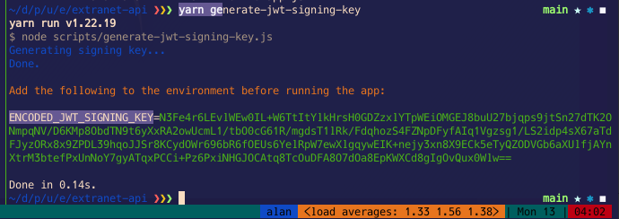

<h1 align="center">
  <br/>
  Wenova-AM Extranet API


</h1>

API for [Wenova-AM](https://www.wenova-am.com)'s extranet app.


# ⚡️ Quickstart

- Clone the repository

```shell
git clone https://github.com/occupytheweb/wenova-am-extranet-api
```

- [Configure the API's runtime](#configuring-the-runtime)
- Run in development mode


<h2>
  <div style="display: flex; justify-content: space-between">
    <div>Docker</div>
    <div align="right">
      <a href="https://docs.docker.com">
        
      </a>
    </div>
  </div>
</h2>


### Pre-Requisites

- [Docker](https://docs.docker.com/engine/install)
- [Docker Compose](https://docs.docker.com/compose/install)


### Building

```shell
docker compose build
```

This will download and cache dependencies, and build the initial development
image.

### 🚀 Running in development mode

```shell
docker compose up
```


<h2>
  <div style="display: flex; justify-content: space-between">
    <div style="display: inline-block">Node + Yarn</div>
    <div style="display: inline-block" align="right">
      <a href="https://nodejs.org">
        
      </a>
      <a href="https://yarnpkg.com">
        
      </a>
    </div>
  </div>
</h2>


- [Install Node](https://nodejs.org). The minimum node version is specified in 
`.node-version`.

- [Install Yarn](https://yarnpkg.com).

- Install dependencies

```shell
yarn
```

- Launch the development server

```shell
yarn dev
```


## Configuring the runtime

Prior to an initial launch, run:

```shell
yarn generate-jwt-signing-key
```

This will generate a base-64 encoded JWT signing key, and print out the
instruction of what to add to the app's environment:




The API supports the following configuration keys:

```dotenv
ENCODED_JWT_SIGNING_KEY : (required)     : Random key, used to sign JWTs. Changing this invalidates previously issued JWTs.
MAX_ITEMS_PER_PAGE      : (default=50)   : The fallback page size for paginated data, when the limit is not specified in a query.
PORT                    : (default=4000) : The port on which the API listens for connections.

DB_USER      : (required)          : The username to use for connecting to the DB.
DB_PASSWORD  : (default="")        : The password to use for connecting the the DB.
DB_NAME      : (required)          : The name of the database to connect to.
DB_HOST      : (default=localhost) : The hostname of the database to connect to.
DB_PORT      : (default=3306)      : The port on which to establish the DB connection.
DB_POOL_SIZE : (default=10)        : The maximum size of the connection pool.

```

These can either be added to the environment prior to launch, or be configured
in a `.env` file at the root of the API's directory.


<h2>
  <div style="display: flex; justify-content: space-between">
    <div>Testing</div>
    <div align="right">
      <a href="https://docs.docker.com">
        
      </a>
      <a href="https://jest.io">
        
      </a>
    </div>
  </div>
</h2>


Testing is done with Jest and Docker.

More info soon.


## 🚀  Deployment


<h3>
  <div style="display: flex; justify-content: space-between">
    <div>Docker</div>
    <div align="right">
      <a href="https://docs.docker.com">
        
      </a>
    </div>
  </div>
</h3>


<h3>
  <div style="display: flex; justify-content: space-between">
    <div>Native, with PM2</div>
    <div align="right">
      <a href="https://pm2.keymetrics.io/docs/usage/quick-start/">
        
      </a>
    </div>
  </div>
</h3>


- Create a deployment `user` and `group`

```shell
sudo useradd extranet-stack --base-dir /opt
```

- Add allowed users to the deployment group

```shell
usermod -a -G extranet-stack some-user
```

- Prepare the base directory for the stack

```shell
cd /opt
sudo mkdir .pm2
sudo chown extranet-stack:extranet-stack .pm2
sudo chmod g+ws .pm2
git config --global --add safe.directory "*"
```

- Prepare PM2's environment

```shell
printf "\nexport PM2_HOME=/opt/.pm2\n\n" | sudo tee -a /etc/{profile,zprofile}
```

This adds `PM2_HOME=/opt/.pm2` to the files `/etc/profile` and `/etc/zprofile`,
which effectively sets the [`PM2_HOME`](https://gooogle.com) environment variable to the same value for
all users.


- Install [PM2](https://pm2.keymetrics.io/docs/usage/quick-start/)

```shell
yarn global add pm2
```

- Clone the API

```shell
cd /opt/extranet-stack
git clone https://github.com/occupytheweb/wenova-am-extranet-api extranet-api
chown extranet-stack:extranet-stack -R .
```

- [Configure the API's environment](#configuring-the-runtime)

- Install dependencies

```shell
yarn
```

- Start the API

```shell
pm2 start src/app.js --name extranet-api
pm2 save
sudo chown extranet-stack:extranet-stack -R /opt/.pm2
```

- Configure the API's proxying

- Configure PM2 to [autostart on server startup](https://pm2.keymetrics.io/docs/usage/startup/)

```shell
pm2 startup
```

Paste the printed command, but modify the `-u ` parameter to `-u extranet-stack`,
and the `--hp ` parameter to `--hp /opt`.

For instance:
```shell
sudo env PATH=$PATH:/usr/bin /usr/lib/node_modules/pm2/bin/pm2 startup systemd -u extranet-stack --hp /opt
```
This will generate and enable a Unix daemon service which will handle starting
pm2 upon server boot.


#### Updating the API

```shell
cd /opt/extranet-stack/extranet-api
git pull
yarn
pm2 reload extranet-api
```


<hr/>

[](https://hits.seeyoufarm.com)
